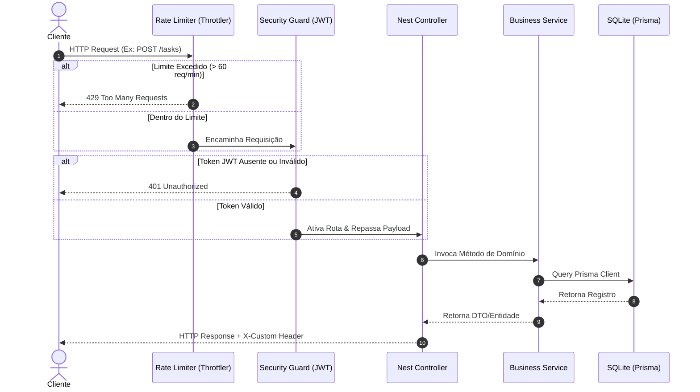

# TaskAPI-NESTJS 🚀

[](https://github.com/gui-bus/TaskAPI-NESTJS/actions/workflows/ci.yml)
[](https://nestjs.com/)
[](https://www.prisma.io/)
[](LICENSE)

API robusta e performática para o gerenciamento de usuários e tarefas cotidianas, desenvolvida seguindo práticas modernas de arquitetura de software utilizando o ecossistema **NestJS**.

---

## 🛠️ Stack Tecnológica & Decisões de Design

* **Core**: [NestJS v11](https://nestjs.com/) (Modular, escalável e tipado).
* **Banco de Dados & ORM**: [Prisma ORM](https://www.prisma.io/) + **SQLite** local (Autocontido, ágil para desenvolvimento local e testes).
* **Segurança**:
  * Autenticação via **JWT (JSON Web Tokens)** com verificação estrita por `AuthTokenGuard`.
  * **Controle de Taxa de Requisições (Rate Limiting)** usando `@nestjs/throttler` (máximo de 60 requisições por minuto por IP) localmente para mitigar brute-force/DOS.
* **Validação**: Validação estrita de DTOs de entrada via `class-validator` e `class-transformer`.
* **Documentação interativa**: [Scalar API Reference UI](https://scalar.com/) integrada de forma limpa sobre o gerador do Swagger.
* **Logger de Auditoria**: Interceptor global (`LoggerInterceptor`) que monitora o tempo de resposta (`latency`) de cada endpoint com o Logger oficial do NestJS.

---

## 📐 Arquitetura do Sistema

O diagrama abaixo ilustra o fluxo de processamento de uma requisição HTTP típica na API, cruzando os Guards de segurança e interceptadores antes de atingir os controllers e serviços:



---

## 📂 Principais Entidades e Relacionamentos

* **User**: Cadastro de usuários com hash de senha seguro e suporte a upload de avatares físicos.
* **Task**: Registro de tarefas vinculadas a um criador. Possui estados no enum `TaskStatus` (`PENDING`, `IN_PROGRESS`, `COMPLETED`).
* **Category (Tag)**: Categorias criadas por usuários para organizar suas tarefas. Uma tarefa pode pertencer a múltiplas categorias e uma categoria pode abranger múltiplas tarefas (relação **Many-to-Many** implícita).

---

## 🚀 Como Executar o Projeto

Você pode rodar a API localmente de duas formas: via **npm** (ambiente de desenvolvimento local) ou via **Docker Compose** (produção/containers).

### Opção A: Rodar Localmente (NPM)

1. **Instale as dependências**:
   ```bash
   npm install
   ```
2. **Configure o banco de dados local (SQLite)**:
   ```bash
   npx prisma db push
   ```
3. **Execute o servidor em modo de desenvolvimento (watch)**:
   ```bash
   npm run start:dev
   ```
4. A API estará de pé em: `http://localhost:3000`

### Opção B: Rodar em Containers (Docker Compose)

Você não precisa instalar Node ou SQLite na sua máquina. Basta ter o Docker instalado e rodar:
```bash
docker compose up -d --build
```
Isso compilará o build de produção multi-stage do Docker e iniciará o container no endereço `http://localhost:3000`.

---

## 📖 Documentação da API (Playground interativo)

Após iniciar o servidor, abra o seu navegador e acesse a documentação do **Scalar**:
👉 **[http://localhost:3000/docs](http://localhost:3000/docs)**

Pelo playground do Scalar, você poderá:
* Efetuar login (`POST /auth`) e copiar o Token JWT de resposta.
* Autenticar a interface clicando em **Authorize** (passando o token).
* Criar categorias, cadastrar tarefas enviando listas de IDs de categorias, filtrar listagens e fazer upload do avatar do usuário de forma totalmente visual.

---

## 🧪 Rodando os Testes

O projeto conta com **76 testes automatizados** cobrindo todas as regras críticas:

```bash
# Executa todos os testes unitários (services, guards e interceptors)
npm run test

# Executa todos os testes de integração e E2E (com cobertura de rotas de controllers)
npm run test:e2e

# Gera o relatório completo de cobertura de testes (Jest Coverage)
npm run test:cov
```

---

## ⚙️ CI/CD (GitHub Actions)

Toda alteração integrada à ramificação `master` aciona um pipeline automático no **GitHub Actions** (`.github/workflows/ci.yml`) que garante a saúde do projeto executando em ambiente limpo:
1. Instalação limpa dos pacotes
2. Verificação de sintaxe e padrões com ESLint (`npm run lint`)
3. Teste de compilação de produção (`npm run build`)
4. Validação de testes unitários e testes E2E integrados com SQLite real.
