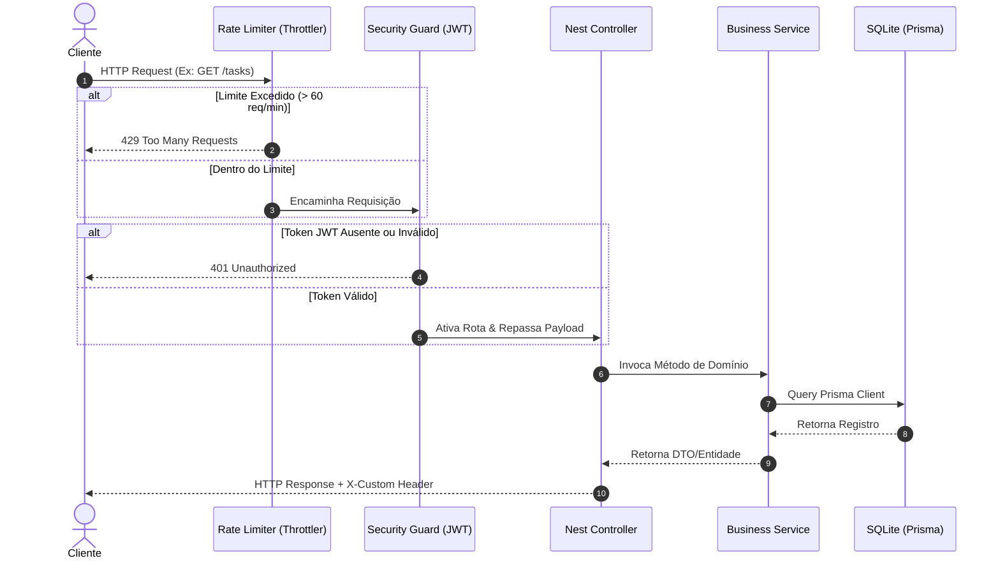

# TaskAPI-NESTJS 🚀

[](https://github.com/gui-bus/TaskAPI-NESTJS/actions/workflows/ci.yml)
[](https://nestjs.com/)
[](https://www.prisma.io/)
[](LICENSE)

API de nível corporativo e altamente performática para o gerenciamento de usuários, tarefas cotidianas e vinculação de categorias. Este projeto foi desenvolvido seguindo padrões rigorosos de arquitetura de software, automação de testes e boas práticas de desenvolvimento no ecossistema **NestJS**.

---

## 🌐 Demo ao Vivo

A API está disponível publicamente e pode ser explorada interativamente pelo Scalar UI:

👉 **[https://taskapi-nestjs.onrender.com/docs](https://taskapi-nestjs.onrender.com/docs)**

> [!NOTE]
> O servidor está hospedado no plano **gratuito do Render**, que entra em modo de hibernação após 15 minutos de inatividade. A **primeira requisição após um período de inatividade pode levar até 60 segundos** para responder (cold start). As requisições seguintes serão imediatas.

---

## 🛠️ Stack Tecnológica & Decisões de Design

* **Core**: [NestJS v11](https://nestjs.com/) (Framework Node.js progressivo baseado em arquitetura modular e tipagem estrita).
* **Banco de Dados & ORM**: [Prisma ORM](https://www.prisma.io/) + **SQLite** local (Autocontido, ágil para desenvolvimento local e testes robustos de integração).
* **Segurança**:
  * Autenticação baseada em **JWT (JSON Web Tokens)** com proteção estrita por meio de um `AuthTokenGuard` global.
  * **Controle de Taxa de Requisições (Rate Limiting)** usando `@nestjs/throttler` (limite padrão de 60 requisições por minuto por IP) para mitigar tentativas de força bruta (Brute-force) ou ataques de DOS.
* **Validação**: Validação estrita de DTOs (Data Transfer Objects) na borda da aplicação usando `class-validator` e `class-transformer` com higienização de propriedades extras (`whitelist: true`).
* **Documentação Interativa**: [Scalar API Reference UI](https://scalar.com/) integrada sobre as definições do Swagger OpenAPI, servida na rota `/docs`.
* **Logger de Auditoria**: Interceptor global (`LoggerInterceptor`) que rastreia os métodos HTTP executados, códigos de retorno e a latência precisa da resposta.

---

## 📐 Padrões de Projeto & Boas Práticas Adotadas

Para demonstrar maturidade e aderência a boas práticas corporativas, o código adota os seguintes pilares:
* **Arquitetura Modular**: Domínios isolados (`AuthModule`, `UsersModule`, `TasksModule`, `CategoriesModule`) promovendo encapsulamento e baixo acoplamento.
* **Injeção de Dependências (DI)**: Utilização nativa do contêiner IoC do NestJS para gerenciamento do ciclo de vida das classes.
* **Princípio da Responsabilidade Única (SRP)**: Separação nítida entre Controladores (entrada/saída e validações), Serviços (regras de negócio) e Camada de Acesso a Dados (Prisma).
* **Soft Delete Pattern (Exclusão Lógica)**: As tarefas contam com controle de exclusão lógica usando o campo `deletedAt`. Isso assegura que registros cruciais não sejam apagados fisicamente do banco por engano, permitindo auditorias.
* **Tratamento de Erros Centralizado**: Factory de erros customizada mapeando códigos de erro específicos para respostas HTTP consistentes.

---

## 📂 Estrutura do Projeto

```
├── prisma/
│   ├── schema.prisma       # Modelagem relacional e enums do banco
│   └── prisma.config.ts    # Configurações do ambiente Prisma
├── src/
│   ├── app/                # Módulo raiz da aplicação
│   ├── auth/               # Regras de autenticação, hashing e JWT
│   ├── categories/         # Módulo de Categorias/Tags (CRUD & Relação Many-to-Many)
│   ├── common/             # Elementos globais (guards, interceptadores, erros)
│   ├── prisma/             # Instância singleton e adapter do Prisma Client
│   ├── tasks/              # Módulo de Tarefas (Busca avançada, status, soft-delete)
│   ├── users/              # Módulo de Usuários (Gerenciamento e upload de avatares)
│   └── main.ts             # Bootstrapping do NestJS com configuração global de Pipes e Guards
├── test/                   # Testes de Integração e E2E (Jest)
├── Dockerfile              # Build otimizado multi-stage para produção
├── docker-compose.yml      # Configuração para subir a aplicação em containers
└── README.md
```

---

## 📐 Fluxo de Requisição da API

O diagrama abaixo ilustra a sequência de verificação pela qual cada chamada HTTP passa antes de interagir com as regras de negócio:



---

## 📊 Modelagem do Banco de Dados (Schema Relacional)

O banco de dados SQLite conta com a seguinte estrutura física de tabelas e enums mapeados no Prisma:

### Tabelas Principais

* **User**:
  * `id`: `Int` (Auto-incremento, chave primária)
  * `email`: `String` (Único)
  * `firstName`: `String`
  * `lastName`: `String`
  * `password`: `String` (Armazena hash bcrypt)
  * `avatar`: `String` (Caminho lógico para o arquivo físico)
  * `active`: `Boolean` (Controle de ativação)
* **Task**:
  * `id`: `Int` (Auto-incremento, chave primária)
  * `name`: `String`
  * `description`: `String`
  * `status`: `TaskStatus` (Enum)
  * `userId`: `Int` (Chave estrangeira relacionando a `User`)
  * `createdAt`: `DateTime`
  * `deletedAt`: `DateTime` (Suporte a Soft Delete)
* **Category**:
  * `id`: `Int` (Auto-incremento, chave primária)
  * `name`: `String`
  * `userId`: `Int` (Chave estrangeira relacionando a `User`)

### Relações e Junções

* **Task $\leftrightarrow$ Category (Many-to-Many)**: Relação implícita gerenciada pelo Prisma através de uma tabela de junção física intermediária (`_TaskToCategory`), permitindo a vinculação dinâmica de múltiplas categorias a uma mesma tarefa.

---

## 🔗 Resumo dos Endpoints Principais

| Método | Endpoint | Protegido? | Descrição |
| :--- | :--- | :--- | :--- |
| **POST** | `/auth` | Não | Autentica um usuário e retorna o Token JWT |
| **POST** | `/users` | Não | Cadastra um novo usuário no sistema |
| **PATCH** | `/users/avatar` | **Sim (JWT)** | Realiza o upload da imagem de avatar do usuário logado |
| **POST** | `/tasks` | **Sim (JWT)** | Cadastra uma tarefa vinculando categorias opcionais |
| **GET** | `/tasks` | **Sim (JWT)** | Lista tarefas paginadas com filtros avançados (`search`, `status`, `categoryId`, ordenação) |
| **PATCH** | `/tasks/:id` | **Sim (JWT)** | Atualiza propriedades, status e categorias de uma tarefa |
| **DELETE** | `/tasks/:id` | **Sim (JWT)** | Executa a remoção lógica (soft delete) da tarefa |
| **POST** | `/categories` | **Sim (JWT)** | Cria uma categoria (tag) para organizar tarefas |
| **GET** | `/categories` | **Sim (JWT)** | Lista todas as categorias criadas pelo usuário |

---

## 💻 Integração de APIs & Consumo Cliente

Esta API foi estruturada para ser consumida de forma simplificada por aplicações cliente (SPAs, Mobile, etc.):

### 1. Formato de Cabeçalho JWT
Todas as rotas marcadas como protegidas requerem o envio do Token JWT nos cabeçalhos da requisição HTTP:
```http
Authorization: Bearer <seu_token_jwt_aqui>
```

### 2. Resposta de Erros Unificada (`AppError`)
Todas as exceções capturadas pela API seguem uma estrutura previsível, facilitando a interceptação e tratamento nos clientes REST:
```json
{
  "status": 401,
  "message": "Acesso não autorizado.",
  "code": "UNAUTHORIZED"
}
```
* **Códigos comuns (`code`)**:
  * `UNAUTHORIZED`: Falha na checagem ou assinatura do token JWT.
  * `INVALID_CREDENTIALS`: Erro de senha ou usuário incorreto.
  * `NOT_FOUND`: O ID consultado de tarefa ou categoria não existe.
  * `TOO_MANY_REQUESTS`: Limite de chamadas do rate limiter atingido.

### 3. Importação OpenAPI (Postman / Insomnia / APIDog)
Você pode obter o JSON bruto de especificação OpenAPI para importá-lo no Postman ou APIDog diretamente na interface do **Scalar UI** (`http://localhost:3000/docs`). Basta clicar no botão de download/cópia da especificação localizado na barra lateral da página interativa.

---

## 🚀 Como Executar o Projeto

### Opção A: Executar Localmente (NPM)

1. **Instale as dependências**:
   ```bash
   npm install
   ```
2. **Configure as Variáveis de Ambiente**:
   Crie um arquivo `.env` na raiz do projeto com base nas seguintes variáveis:
   ```env
   PORT=3000
   DATABASE_URL="file:./dev.db"
   JWT_SECRET="um-segredo-longo-e-seguro-para-assinatura-do-jwt"
   JWT_TTL="3600"
   JWT_TOKEN_AUDIENCE="http://localhost:3000"
   JWT_TOKEN_ISSUER="http://localhost:3000"
   ```
3. **Execute as Migrações do Banco**:
   ```bash
   npx prisma db push
   ```
4. **Inicialize o Servidor**:
   ```bash
   npm run start:dev
   ```

### Opção B: Executar em Containers (Docker Compose)

Certifique-se de ter o Docker e Docker Compose instalados e execute:
```bash
docker compose up -d --build
```
Isso criará os volumes para persistência local do banco e da pasta de arquivos, servindo a aplicação em `http://localhost:3000`.

---

## 📖 Playground da Documentação (Scalar UI)

Após inicializar a aplicação, você poderá testar os endpoints interativamente e ler detalhadamente a especificação OpenAPI acessando:
👉 **[http://localhost:3000/docs](http://localhost:3000/docs)**

---

## 🧪 Suíte de Testes Automatizados

O projeto conta com **76 testes automatizados** para garantir a estabilidade do fluxo de dados:

```bash
# Executa todos os testes unitários (Services, Guards e Interceptors com mocks)
npm run test

# Executa todos os testes de integração E2E com banco de dados SQLite temporário
npm run test:e2e

# Exibe relatório detalhado de cobertura de testes (Jest Coverage)
npm run test:cov
```

---

## ⚙️ CI/CD (GitHub Actions)

A esteira automatizada de CI em [.github/workflows/ci.yml](file:///.github/workflows/ci.yml) executa verificações estritas a cada mudança integrada à branch `master`:
* **Linting**: Validação de padrões de escrita e qualidade de código com ESLint.
* **Build Compilation**: Garante que o build TypeScript é compilado sem avisos ou erros.
* **Testing Suites**: Roda todas as baterias de testes unitários e testes de integração de ponta a ponta (E2E) em ambiente Docker Linux limpo.
